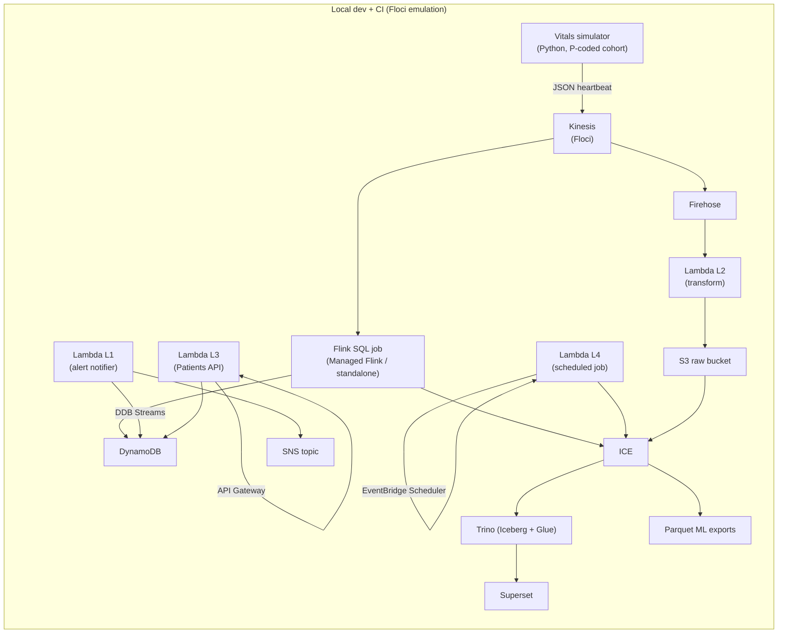
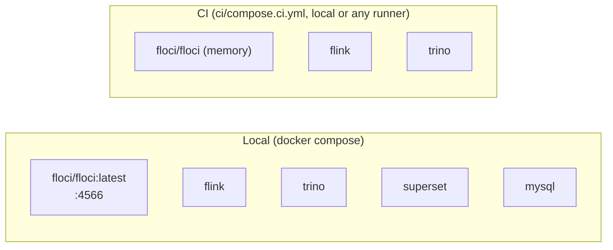

# Architecture Design

Status: Draft v1 — healthcare-realtime-vitals-lakehouse
Date: 2026-09-15
Source of truth: `docs/SCOPE.md` (§5, §12 decisions)

## 1. System Context

## 2. Component Responsibilities

| Component | Role | Notes |
|---|---|---|
| Vitals simulator | Simulates bedside devices streaming vitals | Python; per-device Hz; keys to patient_id (P-coded demo cohort) |
| Kinesis (Floci) | Ingestion buffer for vitals | Streams/shard model |
| Firehose | Optional raw fast-path | Buffered → S3 |
| Lambda L2 | Firehose transform: normalize vitals JSON | Base64 record handling, batching |
| Flink SQL | Windowed aggs, alert rules, dual-write to Iceberg | Checkpointed; exactly-once to Iceberg sink |
| DynamoDB | Alerts table + latest-state for API | Streams enabled for L1 |
| Lambda L1 | DDB Streams → SNS/SES notify | DLQ + retries |
| Lambda L3 | REST API over DDB (patients, latest vitals, alerts) | API GW v2 |
| Lambda L4 | Scheduled Iceberg maintenance + Parquet ML export | Cron, idempotent |
| S3 (Floci) | Data lake storage (raw + Iceberg warehouse) | boto3-compatible |
| Glue (Floci) | Data Catalog for Iceberg tables | Trino reads catalog |
| Trino | Query engine: window functions, CTEs, time-series, joins | Iceberg + Glue catalog |
| Superset | Dashboards (live + historical) | Connects to Trino |

## 3. Data Flow Overview

1. **Streaming vitals**: simulator → Kinesis → Flink SQL → Iceberg tables
   (`vitals`, `vitals_1m`, `vitals_hop_1m`) via the Nessie catalog; `patients`
   is a small demo dimension (workshop bootstrap, `sql/workshop/00`).
2. **Streaming vitals**: simulator → Kinesis. Two consumers:
   - Firehose → L2 transform → S3 → Iceberg raw tables.
   - Flink → windowed aggregates (serving tables) + alert rules → DynamoDB.
3. **Alerting**: DynamoDB stream → L1 → SNS/SES notify.
4. **Query**: Superset → Trino → Iceberg/Glue; joins vitals with patient data.
5. **API**: API GW → L3 → DynamoDB read-model.
6. **Maintenance/ML**: EventBridge Scheduler → L4 → Iceberg compaction +
   Parquet export for ML training.

## 4. Technology Summary

| Area | Choice | Why |
|---|---|---|
| Ingest | Kinesis (Floci) | AWS-shaped, interview relevant |
| Processing | Flink SQL | Windowed/event-time semantics, CTE-ish SQL |
| Serverless | Lambda (Python, zip) | L1–L4 learning path, real Docker on Floci |
| Storage | S3 + Iceberg, Glue catalog | Open table format, ML-ready Parquet |
| DynamoDB | Reads/serving + stream source | Pair with Lambda (core AWS pattern) |
| Query | Trino + Superset | Windows/CTEs/joins + mature dashboards |
| ML data | Parquet exports | Prepare training/val splits |
| IaC | OpenToFu/Terraform | Floci-compatible, portable to AWS |
| CI/CD | local gates (`make`); CI host deferred | Scratch → local |

## 5. Runtime Topology

- **Local dev**: `docker compose` — floci, flink,
  trino, superset, mysql (superset meta), nessie (fallback catalog).
- **CI-ready**: `ci/compose.ci.yml` — same core, Floci storage mode `memory`,
  no Superset UI (headless asserts), no persistent volumes.

## 6. Deployment Model

- v1 target: everything local/CI against Floci. Real AWS is out of scope but
  the code/IaC is endpoint-portable: swap `AWS_ENDPOINT_URL`/creds and apply
  Terraform to real AWS.
- Lambda functions deployed as zip artifacts via Terraform (`source` + hash);
  not container images (keeps learning path focused; images are a later
  extension).

## 7. Design Constraints & Decisions

- Single-region, single-account (`000000000000` default in Floci, 12-digit
  account isolation if desired).
- VPC-less: all local networking, no inter-service network security in v1.
- Event-time semantics preferred in Flink; late data tolerated (allowed
  lateness window configured; see RELIABILITY.md).
- Raw payloads preserved in S3 for replay/debugging; normalized views in
  Iceberg tables.

## 8. Open Design Questions

- Firehose vs direct Flink raw-write for the historical lake (both in v1?).
- Serving "latest vitals" via DDB read model refresh vs Trino query.
- Streamed patient_id coverage vs the demo `patients` dimension (see SCOPE §11).