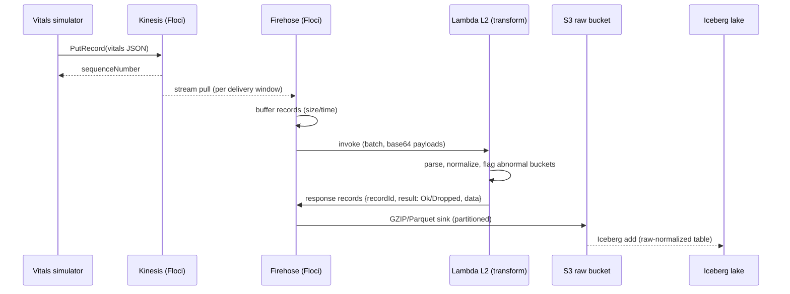
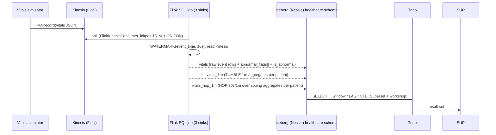
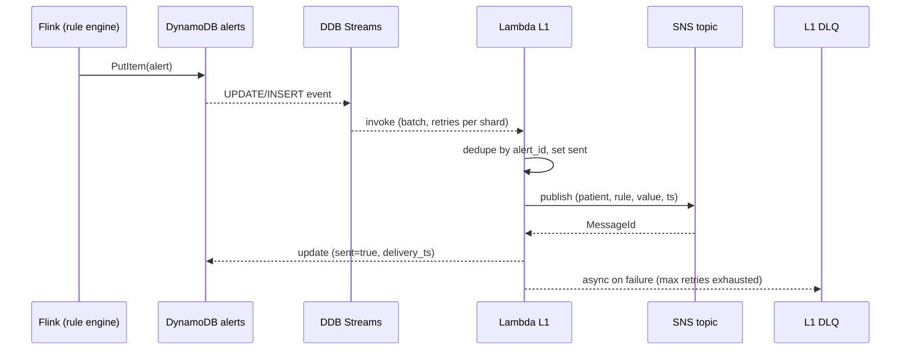
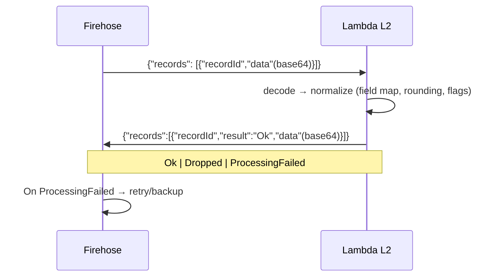
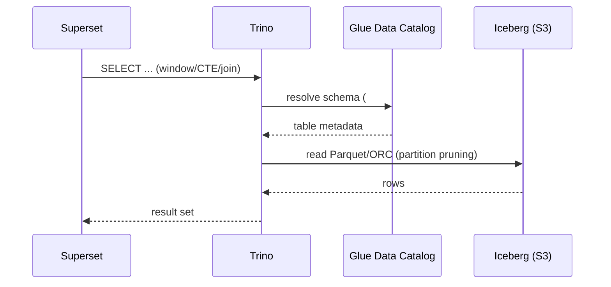
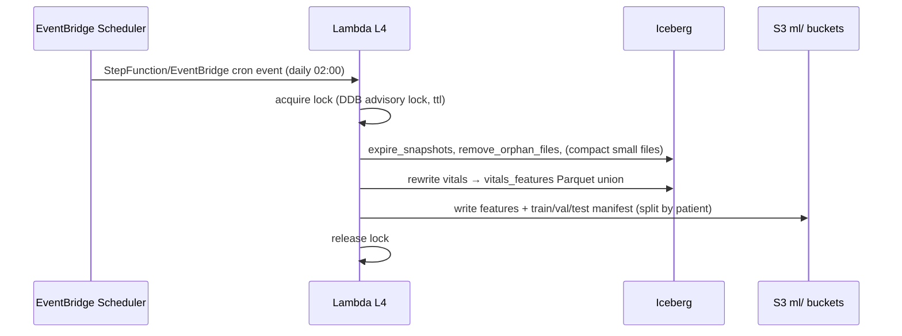

# Data Flow Design

Status: Draft v2
Date: 2026-09-16
Sequence diagrams for each end-to-end path. Mermaid `sequenceDiagram`.

## 1. Vitals Ingest — Firehose + L2 Transform Path

Retries: FH retries failed batches; `result: ProcessingFailed` moves to the
S3 `.failures/` prefix (Floci/PutRecordBackup). L2 idempotent on recordId.

## 2. Vitals Ingest — Flink Aggregation + Serving

One job (`job.sql`), three streaming INSERTs — each lands as its own Flink job
so TUMBLE/HOP/window dialects run side by side on the same stream. Sinks write
Parquet via Iceberg and only publish **on checkpoints** (`IcebergFilesCommitter`):
if the clusters tables stay empty, the checkpoint interval is missing
(`execution.checkpointing.interval`; see FLINK_OPS.md).

Read-time processing happens in the lake: window functions (LAG/LEAD, moving
averages) and CTEs run over `vitals` in Trino — see `sql/workshop/`.

Designed-but-not-wired: Firehose/L2 and the DynamoDB `latest_vitals` read-model
refresh from this path (see DATA_MODEL §5/§8).

## 3. Alert Path — L1 Notifier (DynamoDB Streams → Lambda → SNS)

Lambda semantics: synch trigger, batch window 1s or 100 incl, `BisectBatchOnErrorEnabled=true`, max retry attempts, DLQ after exhaustion. Idempotent via the `sent` guard.

## 4. Firehose transform detail (L2) — record contract

Rules: exactly one response per input recordId; batch up to 10k records in
bounded time; don't buffer state across invocations; log recordIds that are
unmapped or failed.

## 5. Query Path

## 6. Patients REST API — L3

```mermaid
sequenceDiagram
    participant CLI as curl / UI
    participant GW as API Gateway v2 (Floci)
    participant L3 as Lambda L3
    participant DDB as DynamoDB

    CLI->>GW: GET /patients/{id}/latest-vitals
    GW->>L3: event {path, query, headers, context}
    L3->>L3: validate id, choose table (latest_vitals | alerts)
    L3->>DDB: GetItem / Query (SK prefix)
    DDB-->>L3: item(s)
    L3-->>GW: {statusCode, body, headers}
    GW-->>CLI: 200 JSON (or 400/404)
```

Errors are handled in L3 and relayed as proper HTTP status codes (no
unhandled 5xx). Optional API-key authorizer in front (SECURITY.md).

## 7. Scheduled Maintenance / ML Export — L4

Idempotency: run date key; DDB lock prevents overlapping runs; manifest write
is atomic (write `.tmp` then rename-in-catalog).

## 8. Cross-cutting Notes

- Event timestamp is authoritative (`event_time`); ingestion stamping for
  latency measurement only.
- Every hop logged with `trace_id` (producer-minted UUID propagated in
  payloads) for debugging replay.
- Replay strategy: raw S3 payloads are the replay source — reprocessing a
  window = re-read raw partition → recompute (see RELIABILITY.md). The Flink
  source replays from the stream (initpos `TRIM_HORIZON`, 24 h Floci
  retention); drop the Iceberg tables before resubmitting to avoid duplicate
  window rows (see FLINK_OPS.md).