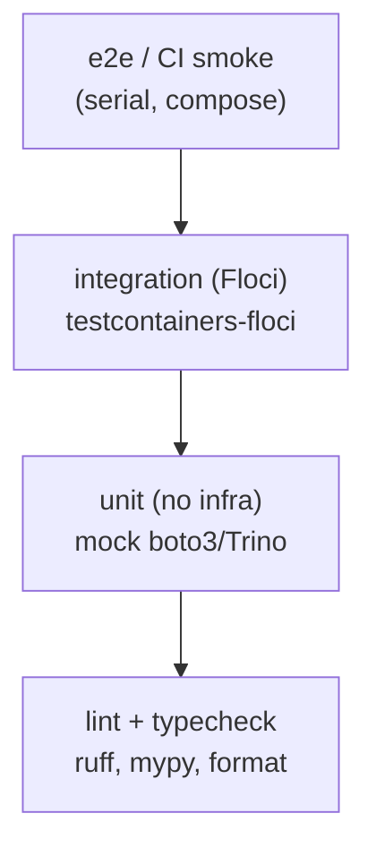

# Testing / QA Strategy

Status: Draft v1
Date: 2026-09-15

## 1. Test Pyramid

| Layer | Cost | Coverage | Cadence |
|---|---|---|---|
| lint/typecheck | trivial | formatting, types | every push |
| unit | fast (ms–s) | logic, mapping, SQL strings | every push |
| integration | seconds–min | Floci services end-to-end hops | MR + nightly |
| e2e / CI smoke | a few min | full pipeline serial flow | MR + nightly |

## 2. Unit Tests

Scope: pure logic, mocked AWS/DB boundaries.

- `producer/`: vitals generation (bucketing, boundary HR), retry/backoff
  logic with mocked boto3.
- `patient_data/`: Synthea→table mapper (id mapping, date coercion,
  dtype), dedupe/overwrite semantics.
- `lambda/L1`: decorate DDB Streams event → SNS payload; `sent` dedupe guard;
  region handling; batch partial failure semantics.
- `lambda/L2`: base64 decode → normalized record / `Dropped` cases;
  `recordId` echo rules; output limits.
- `lambda/L3`: path/query parsing, table selection, status-code mapping,
  400/404 paths.
- `lambda/L4`: manifest writer, split-by-patient, lock acquisition TTL.
- `flink`: SQL UDFs/expressions as pure functions (where extractable);
  Iceberg DDL/DML statement golden tests.
- `sql/`: query snapshots (window fn / CTE examples) parsed via Trino
  `EXPLAIN` elsewhere in integration; unit validates SQL text fixtures.

Snapshot tests for payload shapes (alerts item, kinesis record).

## 3. Integration Tests (Floci)

`testcontainers-floci` (PyPI) for isolated per-test instances. Tag `floci`.

| Test | Flow | Assertion |
|---|---|---|
| `it_kinesis_roundtrip` | puts N records → stream | GetRecords returns them, seq nums ordered |
| `it_firehose_l2` | put → Firehose → S3 | object exists; normalized Parquet/JSON rows match |
| `it_trino_iceberg` | insert + select via Trino over Glue/Iceberg | row round-trip, partition prune works |
| `it_alerts_flow` | Flink rule → alert item → DDB Stream → L1 → SNS | SNS message received, `sent=true` |
| `it_api` | GET patient latest / alerts | 200 + expected JSON; 404 unknown id |
| `it_maintenance` | run L4 once | manifest + feature files exist; lock released |
| `it_window_query` | CTE/window SQL against seeded vitals | expected aggregates/total |

Test data fixtures: `tests/fixtures/` deterministic patient set + vitals
window (small) — replay-safe.

## 4. End-to-End / CI Smoke

`tests/e2e/test_pipeline_smoke.py` (serial, compose up):

1. Load Synthea cohort (small, ~50 pts) → Iceberg.
2. Run simulator 60 s (or loop until 500 events) → Kinesis.
3. Wait: Firehose flushes → L2 → raw S3 → Iceberg raw table.
4. Assert Trino count over `vitals` reaches expected window.
5. Trigger rule (fixture high-HR) → DDB → L1 → SNS captured.
6. Call API: latest_vitals for seeded patient returns reading.
7. `tofu apply` dry-run? no — separate `deploy` stage.

Exit code 0 = green; CI artifacts capture logs + a `report.json`.

## 5. Test Tooling & Config

- `pytest` + `pytest-xdist` (unit auto-parallel), markers:
  `unit`, `floci`, `e2e`, `slow`.
- `pytest-asyncio` where handlers are async (AWS SDK async client).
- Coverage: 90% unit threshold on core modules (lambdas, mapper, producer)
  enforced in CI (`fail_under`).
- `ruff`, `mypy` strict on `lambda/`, `producer/`, `patient_data/`.
- Shell scaffolding: `Makefile` targets `test-unit`, `test-integration`,
  `test-e2e`, `ci` (all).
- Trino SQL: `tests/sql/*.sql` executed in integration against seeded data;
  also used as docs (verify check).

## 6. QA Gates (Merge to Main)

1. lint + typecheck pass.
2. unit ≥90% threshold on core modules.
3. integration green on MR (Floci).
4. e2e smoke green on MR (serial compose) — or nightly if heavy; default MR.
5. No banned secrets pattern; `uv.lock` deterministic.

## 7. Failure Diagnostics

- On red: collect Trino query errors, Lambda CloudWatch logs, DLQ depths,
  output from `docker compose ps`/`logs`.
- `scripts/collect_diagnostics.sh` aggregates into `diagnostics/` artifact.
- Re-run commands documented in `Makefile` (`logs`, `ps`, `reset`).

## 8. Risk-Based Emphasis

High-risk/novel: Flink↔Kinesis+Glue on Floci (M2), L1 DDB Streams mapping,
L2 batching, Trino Glue Iceberg catalog. These get dedicated integration
suites before feature completion — matches RELIABILITY.md §7 targets.